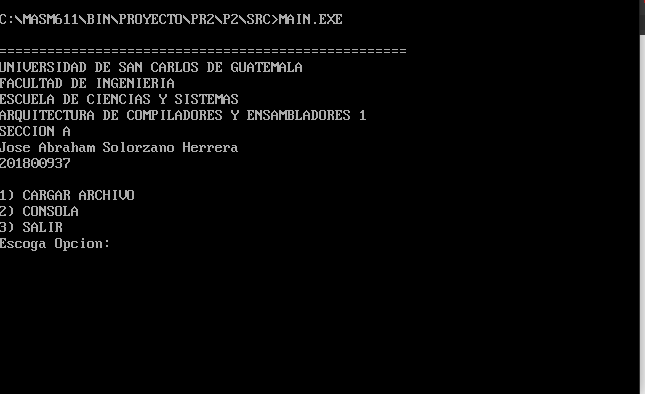
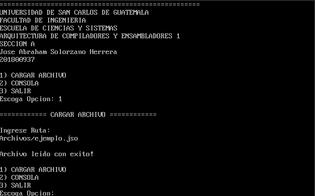
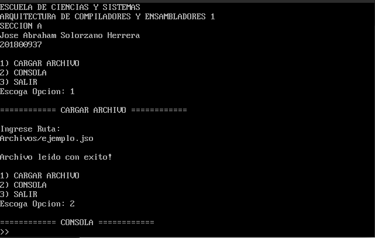
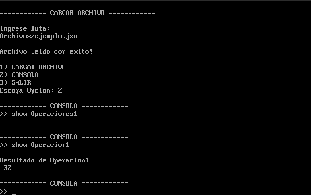
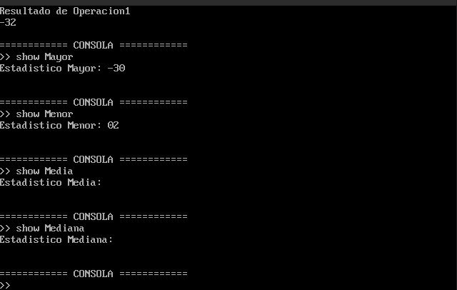
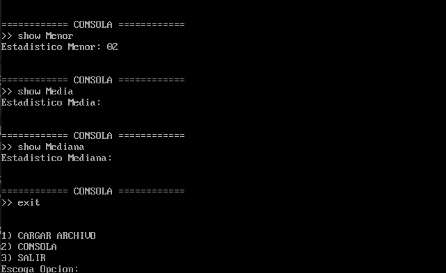
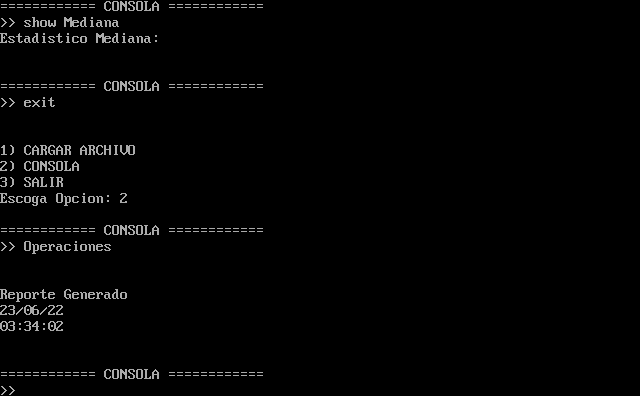

# [Manual Usuario](../README.md)
____________

Identificador Y Menu

Al seleccionar el boton 1, puede cargar el archivo a leer, en este caso será .jso

Al seleccionar el boton 2, puede acceder a la consola.

Al estar en la consola tiene la oportunidad de poder hacer operaciones, ya sea suma, resta, multiplicación y divisón.

Además en la consola también tiene la opción de ver tanto el número mayor, número menor, media, y mediana

Tiene un comando que se llama exit, que es el encargado de salir de la consola.

Al ingresar el comando padre tendrá la opción de generar el reporte.

